# 📦 Compressed Blocks

> **Squish ALL your blocks into tiny packages!**


---

## 🎮 What Does It Do?

**Turn 9 blocks into 1!** Then turn 9 of *those* into 1! Keep going up to **32 times!**

```
Level 1  = 9 blocks
Level 2  = 81 blocks
Level 3  = 729 blocks
Level 4  = 6,561 blocks
...
Level 32 = MORE BLOCKS THAN ATOMS IN THE UNIVERSE! 🤯
```

---

## ⚡ Quick Start

### Just Use a Crafting Table! 🎉

```
┌───┬───┬───┐
│ 🪨 │ 🪨 │ 🪨 │
├───┼───┼───┤
│ 🪨 │ 🪨 │ 🪨 │  →  📦 Compressed Stone [Lv.1]
├───┼───┼───┤
│ 🪨 │ 🪨 │ 🪨 │
└───┴───┴───┘
```

**That's it!** Fill a 3x3 grid with ANY block → Get 1 compressed block!

### To Decompress:
Put 1 compressed block alone in crafting grid → Get 9 back!

---

## 🔄 Standard Recipes = Mod Compatible!

Uses proper Minecraft recipes, so:
- Works in any crafting table
- Other mods can use these recipes too
- No special items required to compress!

---

## 🎯 How It Works

| Action | Result |
|--------|--------|
| **9 blocks in 3x3** | 1 compressed block |
| **Compressed block alone** | 9 blocks back |
| **9 compressed blocks in 3x3** | 1 higher-level compressed block |

---

## 🛠️ Bonus Tools

Want even faster compression? We got you!

### Compression Wand (Optional Speed Tool)

```
      [ ]  [💎]  [🔮]
      [ ]  [🪵]  [💎]
      [🪵] [ ]   [ ]

💎 = Diamond
🔮 = Amethyst Shard  
🪵 = Stick
```

Hold blocks in off-hand, right-click to compress instantly!

### Compressor Block (Alternative)

```
      [🔩] [⬛] [🔩]
      [⬛] [🧲] [⬛]
      [🔩] [⬛] [🔩]

🔩 = Iron Ingot
⬛ = Piston
🧲 = Lodestone
```

---

## 💬 Commands

| Command | What It Does |
|---------|-------------|
| `/cblocks help` | Show help |
| `/cblocks give wand` | Get the magic wand! |
| `/cblocks give compressor` | Get compressor block |
| `/cblocks give all` | Get everything! |
| `/cblocks info` | Info about held block |

---

## ❓ FAQ

**Q: What blocks can I compress?**  
A: Almost ALL of them! Stone, dirt, wood, glass, stairs, slabs... if you can place it, you can probably compress it!

**Q: Can I uncompress?**  
A: Yes! Shift + right-click with the wand!

**Q: Does it work in multiplayer?**  
A: Absolutely! Works on servers too!

**Q: Do I need to be OP?**  
A: Nope! Regular players can use all the main commands!

---

## 📥 Installation

### As a Mod (Recommended)
1. Install [Fabric Loader](https://fabricmc.net/)
2. Install [Fabric API](https://modrinth.com/mod/fabric-api)
3. Drop `compressed-blocks-1.0.0.jar` in your `mods` folder
4. Play!

### As a Datapack
1. Download `compressed-blocks-datapack-1.0.0.zip`
2. Put it in your world's `datapacks` folder
3. Run `/reload`
4. Play! *(Some features limited without mod)*

---

<br><br>

# 🏗️ Technical Documentation

*For modders, developers, and curious minds!*

---

## Architecture Overview

This mod uses a **hybrid architecture** - it works as both a Fabric mod AND a standalone datapack.

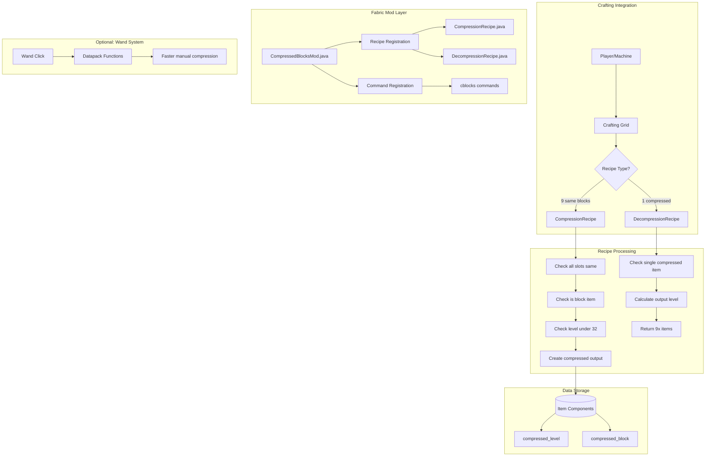

---

## Module Structure

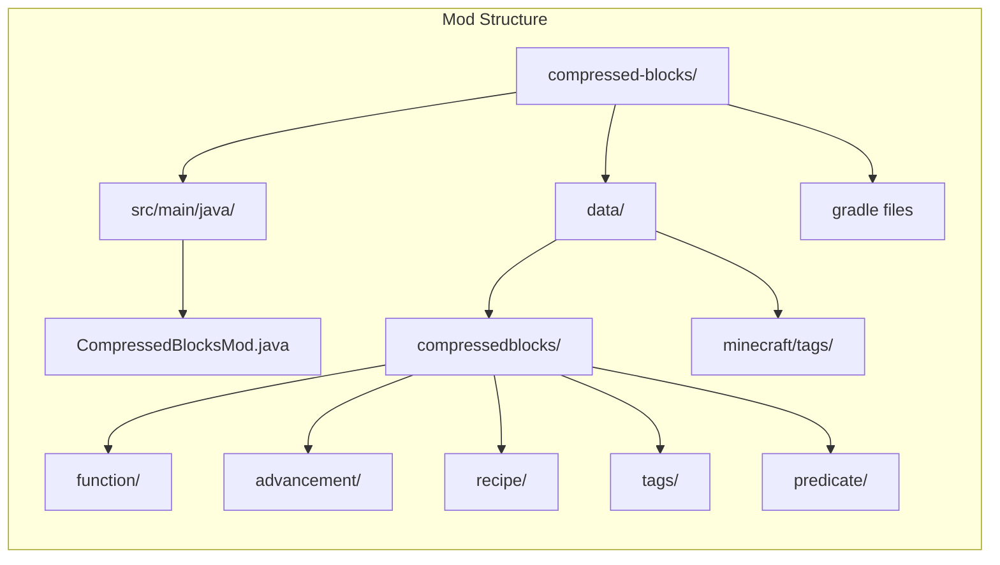

---

## Compression Flow (Crafting System)

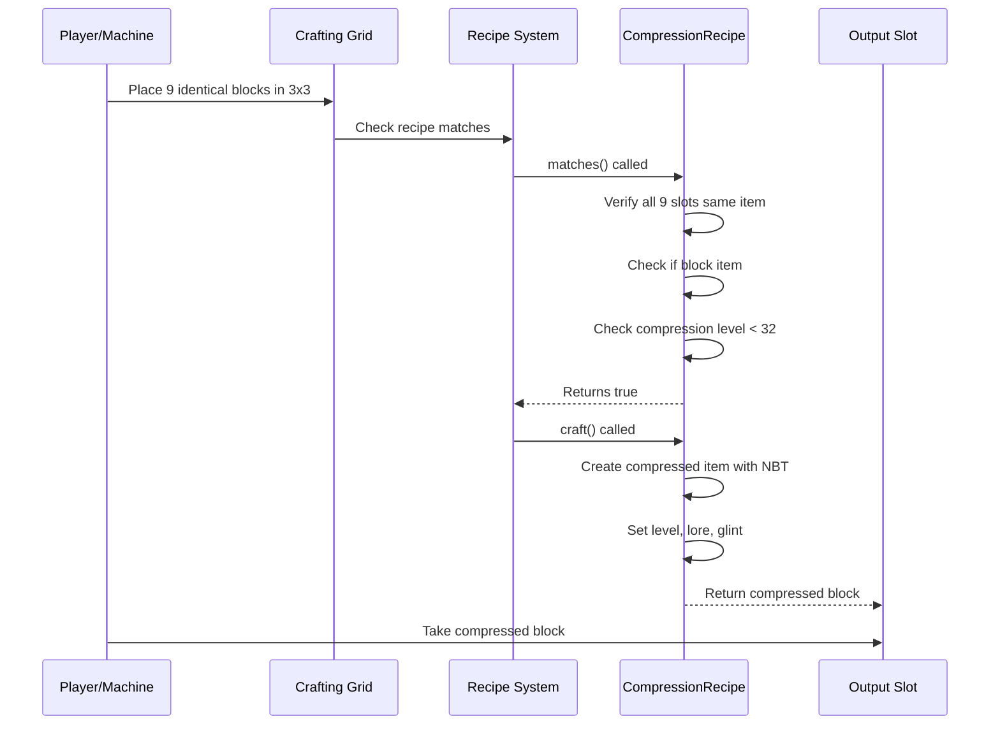

### Decompression Flow

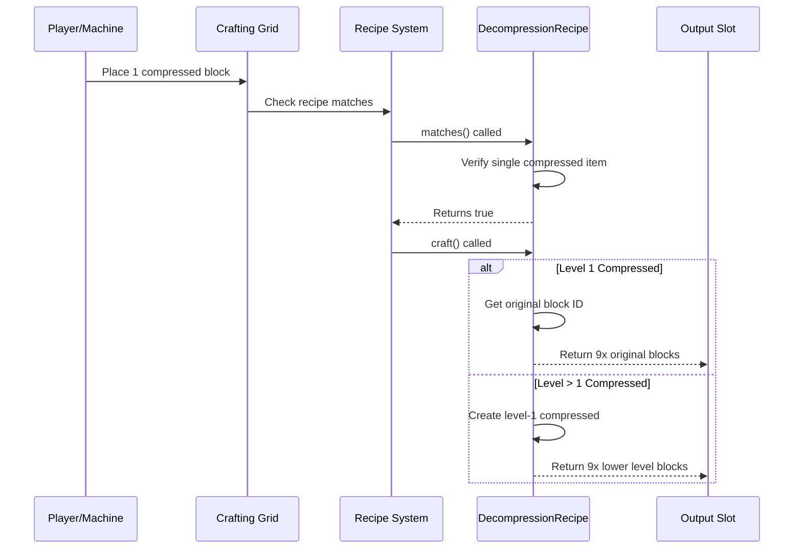

## Wand Flow (Optional Tool)

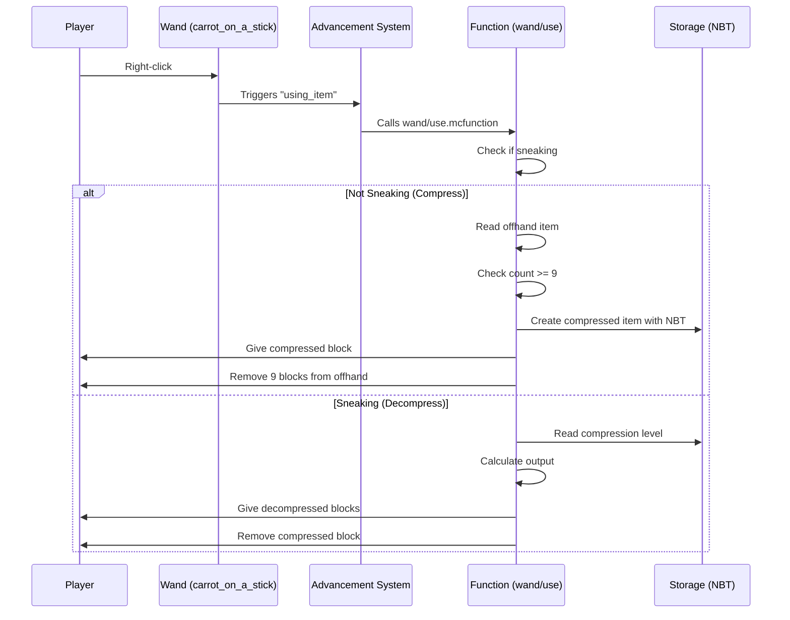

---

## Data Flow for Compression Levels

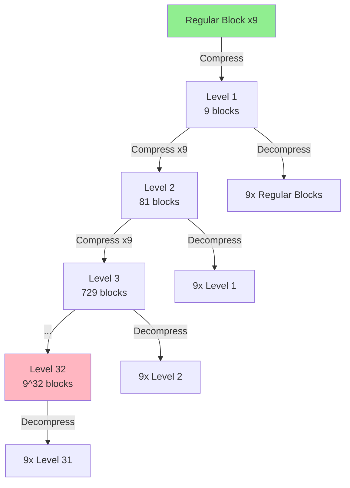

---

## NBT Component Structure

Compressed blocks store their data in item components:

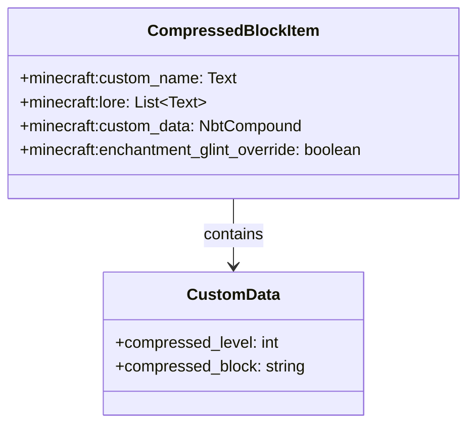

### Example NBT:
```json
{
  "minecraft:custom_data": {
    "compressed_level": 3,
    "compressed_block": "minecraft:cobblestone"
  }
}
```

---

## Placed Compressed Blocks (Data Preservation)

When you place a compressed block in the world, we need to preserve all the compression data without losing potentially **millions of blocks**! Here's how we do it:


### Why This Approach?

1. **REAL BLOCK** - Full vanilla behavior (collision, redstone, piston, explosions)
2. **INTERACTION entity** - Invisible entity at block position stores all NBT data
3. **TEXT_DISPLAY** - Shows the compression tier (Roman numeral) above block
4. **OVERLAY block_display** - Semi-transparent dark overlay for visual darkening

### Breaking Compressed Blocks

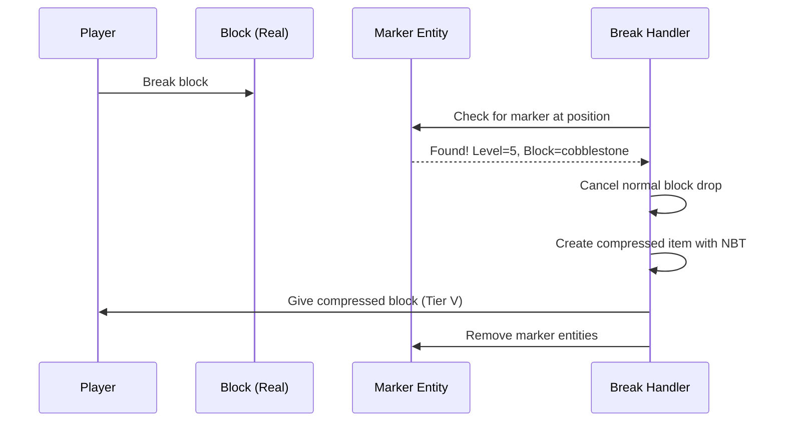

### Visual Darkening System

Higher compression levels = darker block appearance:

| Level | Brightness | Visual Effect |
|-------|------------|---------------|
| 1 | Full (15) | Normal block |
| 2-5 | High (12-14) | Slight darkening |
| 6-15 | Medium (8-12) | Noticeable shadow |
| 16-25 | Low (4-8) | Dark overlay |
| 26-32 | Very Low (2-4) | Deep shadow |

This is achieved using a `block_display` entity with black stained glass, scaled to cover the block, with reduced brightness values.

---

## Automatic Block Detection System

**No config files. No block lists. No tags needed.**

We use Minecraft's built-in registry system:

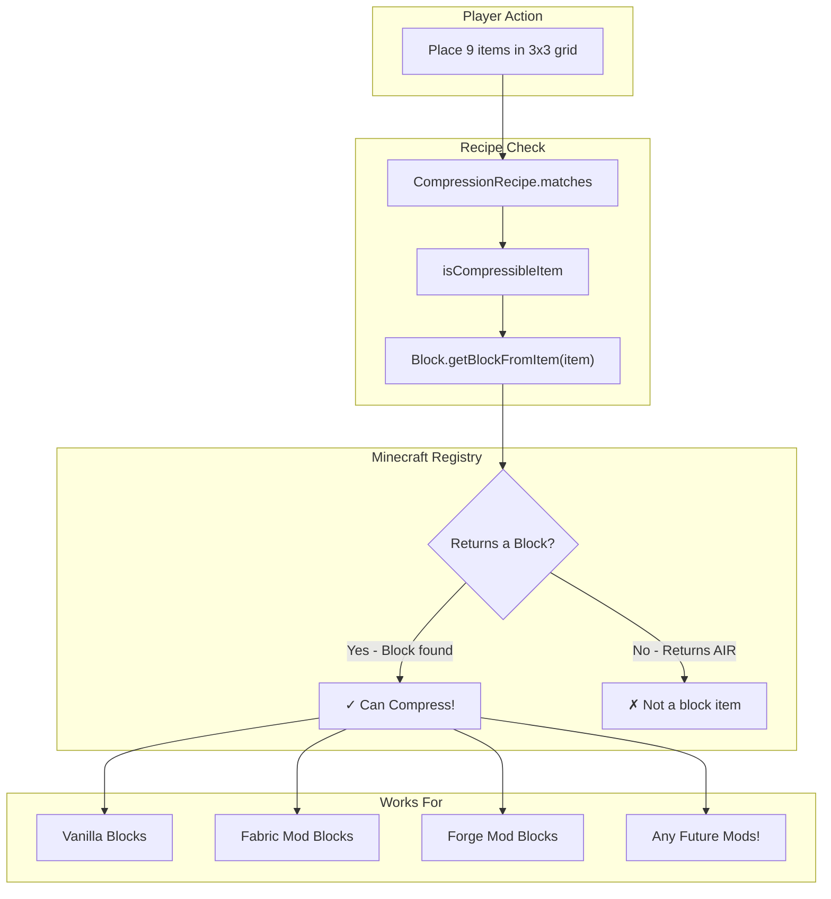

### How It Works:

```java
// The magic line - queries Minecraft's block registry
var block = Block.getBlockFromItem(item);

// If it returns a real block (not AIR), it's compressible!
if (block != Blocks.AIR) {
    return true; // Can compress!
}
```

### Why This Works For ALL Mods:

1. **Registry-based** - When ANY mod registers a block, they also register a BlockItem
2. **Automatic linking** - Minecraft's registry links BlockItems to their Blocks
3. **Universal query** - `Block.getBlockFromItem()` queries this registry
4. **Zero config** - No need to add mod blocks to any list!

### What CAN Be Compressed:
- ✅ Any vanilla block (stone, dirt, logs, stairs, slabs, glass, etc.)
- ✅ Any modded block (Create, Botania, Mekanism, etc.)
- ✅ Already-compressed blocks (for higher tiers)

### What CANNOT Be Compressed:
- ❌ Items without block form (swords, tools, food, etc.)
- ❌ Level 32 compressed blocks (max tier reached)

---

## File Structure

```
compressed-blocks/
├── 📄 build.gradle              # Build configuration
├── 📄 settings.gradle           # Gradle settings
├── 📄 gradle.properties         # Version config
├── 📄 pack.mcmeta              # Datapack metadata
├── 📄 LICENSE                  # MIT License
│
├── 📁 data/                    # Datapack files
│   ├── 📁 compressedblocks/
│   │   ├── 📁 function/        # All the magic happens here!
│   │   │   ├── 📁 wand/        # Wand interaction logic
│   │   │   ├── 📁 compressor/  # Compressor block logic  
│   │   │   ├── 📁 give/        # Item giving functions
│   │   │   ├── 📁 admin/       # Admin commands
│   │   │   ├── 📄 load.mcfunction
│   │   │   ├── 📄 tick.mcfunction
│   │   │   └── 📄 help.mcfunction
│   │   │
│   │   ├── 📁 advancement/     # Trigger detection
│   │   ├── 📁 recipe/          # Crafting recipes
│   │   ├── 📁 tags/            # Block/item tags
│   │   └── 📁 predicate/       # Condition checks
│   │
│   └── 📁 minecraft/tags/      # Load/tick hooks
│
└── 📁 src/main/
    ├── 📁 java/com/compressedblocks/
    │   ├── 📄 CompressedBlocksMod.java  # Main mod entry
    │   ├── 📄 CompressedBlockHandler.java  # Placement & breaking
    │   └── 📁 recipe/
    │       ├── 📄 CompressionRecipe.java
    │       ├── 📄 DecompressionRecipe.java
    │       ├── 📄 CompressionRecipeSerializer.java
    │       └── 📄 DecompressionRecipeSerializer.java
    │
    └── 📁 resources/
        ├── 📄 fabric.mod.json  # Mod metadata
        └── 📄 pack.mcmeta      # Resource pack meta
```

---

## Key Functions Explained

### `CompressedBlockHandler.java` (Core Placement System)

The heart of data preservation! Handles:

1. **Block Placement Interception**
   - Detects when player places a compressed item
   - Places the REAL block in the world
   - Spawns marker entities to store compression data
   - Creates visual overlays for tier display

2. **Block Break Interception**
   - Detects when breaking a block with compression markers
   - Cancels normal drops
   - Creates compressed item with full NBT data
   - Returns the compressed item to player

```java
// Marker entity stores data in custom name (datapack-compatible hack)
marker.setCustomName(Text.literal(level + ":" + blockId));
```

### `CompressionRecipe.java` / `DecompressionRecipe.java`

Custom SpecialCraftingRecipes that enable:
- Automatic 3x3 compression in ANY crafting table
- Single-item decompression
- Works with automation mods (hoppers, Create, AE2, etc.)

### `wand/compress.mcfunction`
Handles the main compression logic:
1. Checks offhand for items
2. Verifies count >= 9
3. Routes to `compress_initial` or `compress_higher`

### `compressor/calculate_block_count.mcfunction`
Pre-calculates display strings for block counts:
- Level 1-6: Exact numbers
- Level 7+: Abbreviated (4.78M, 43M, etc.)
- Level 16+: Word descriptions (Quadrillions+)

### `wand/decompress.mcfunction`
Reverses compression:
- Level 1 → 9 regular blocks
- Level N → 9 blocks of level N-1

---

## Performance Considerations

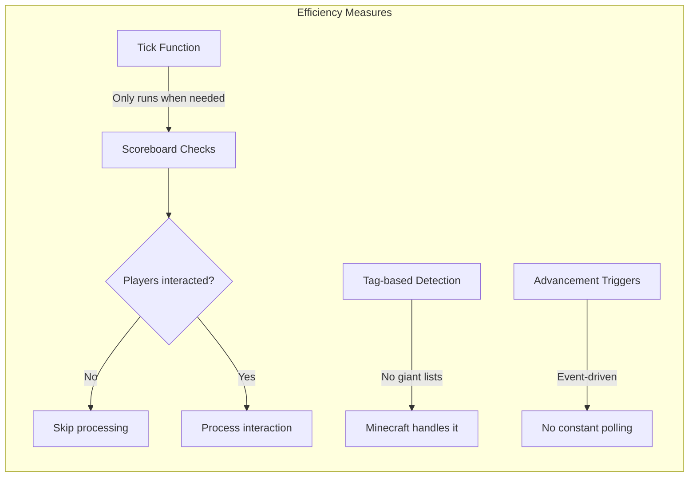

### Why It's Fast:
1. **No tick spam** - Only processes when players actually interact
2. **Tag-based blocks** - Minecraft's native tag system, not custom lists
3. **Advancement triggers** - Event-driven, not polling every tick
4. **Scoreboards for state** - Efficient primitive storage

---

## Build Variants

We provide **two versions** of the mod:

| Variant | File | Features |
|---------|------|----------|
| **FULL** | `compressed-blocks-1.0.0.jar` | Place compressed blocks in world with visual overlays |
| **LITE** | `compressed-blocks-lite-1.0.0.jar` | Inventory-only, no placement (lighter weight) |

### Why Choose LITE?

The LITE version is perfect for:
- 🎮 **Servers** - Zero world overhead, no entities to track
- ⚡ **Performance** - No block break interception, no entity spawning
- 📦 **Pure Storage** - Use compressed blocks only for inventory management
- 🔧 **Automation Focus** - Pairs perfectly with storage mods

### LITE Mode Behavior

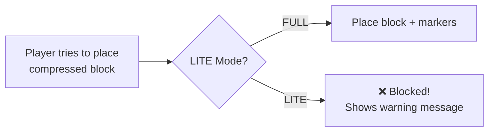

---

## Building From Source

```bash
# Clone the repo
git clone https://github.com/Underwood-Inc/compressed-blocks.git
cd compressed-blocks

# Build everything (creates BOTH variants)
./gradlew build

# Outputs:
# - build/libs/compressed-blocks-1.0.0.jar (FULL version)
# - build/libs/compressed-blocks-lite-1.0.0.jar (LITE version)
# - build/datapacks/compressed-blocks-datapack-1.0.0.zip (Standalone)
```

### Runtime Mode Switch

You can also force LITE mode at runtime with a system property:
```bash
java -Dcompressedblocks.lite=true -jar minecraft_server.jar
```

---

## Contributing

1. Fork the repo
2. Create a feature branch
3. Make your changes
4. Test in-game
5. Submit a PR!

---

## License

MIT License - Do whatever you want! Just give credit! 💜

---

<div align="center">

**Made with 💜 by the Underwood Inc team**

[Discord](https://discord.gg/mpThbx67J7) • [GitHub](https://github.com/Underwood-Inc) • [Modrinth](https://modrinth.com)

</div>

