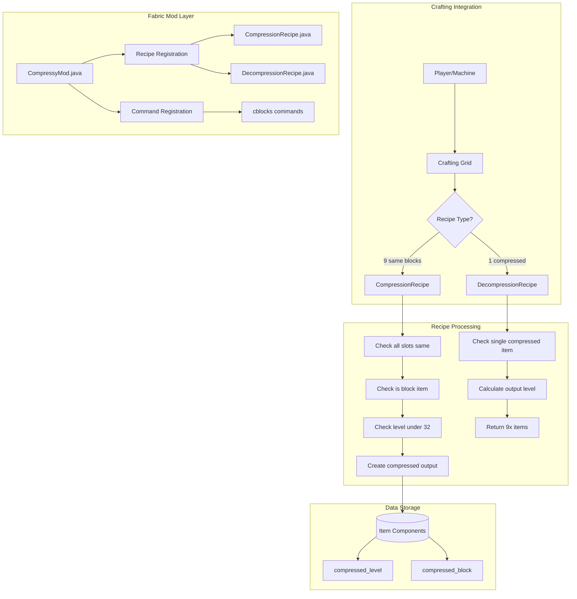
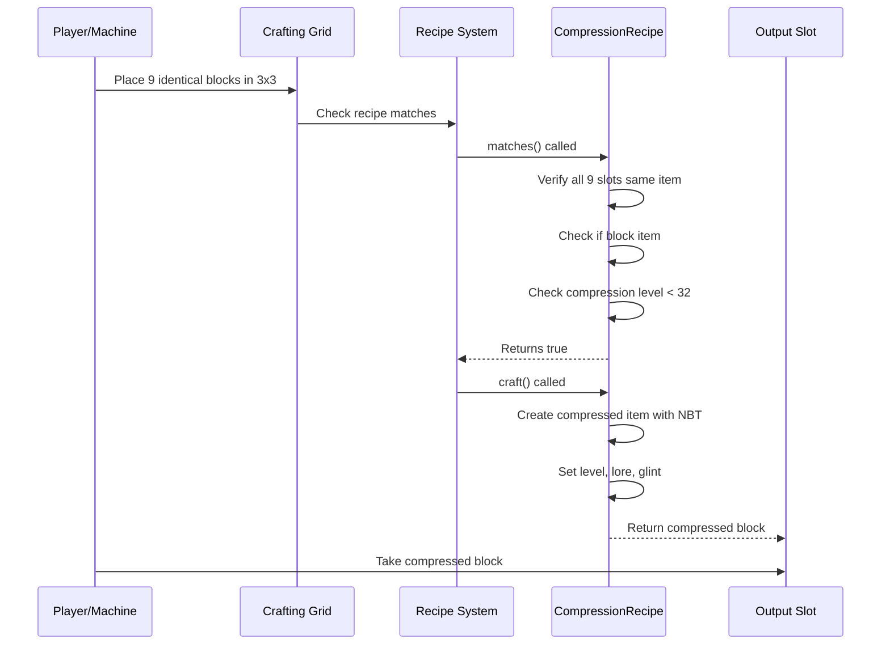
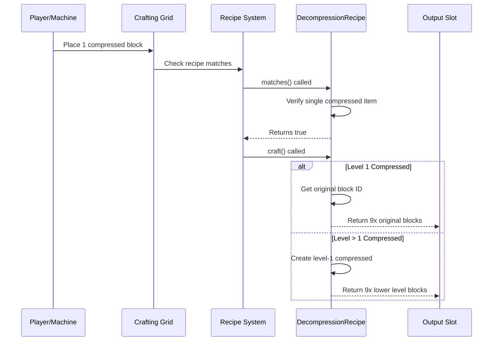
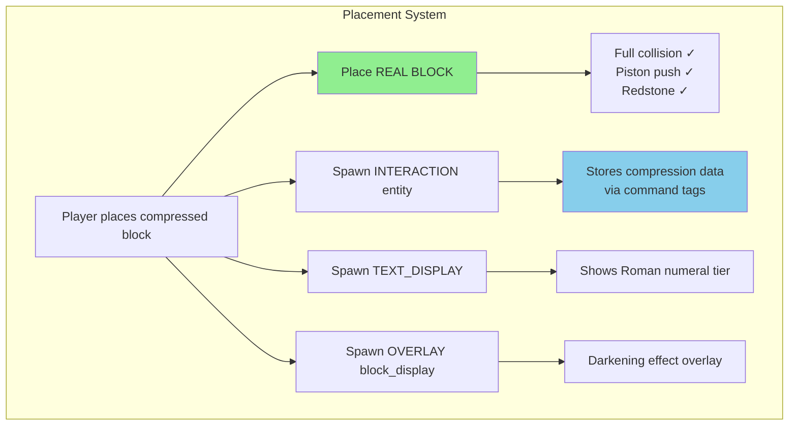
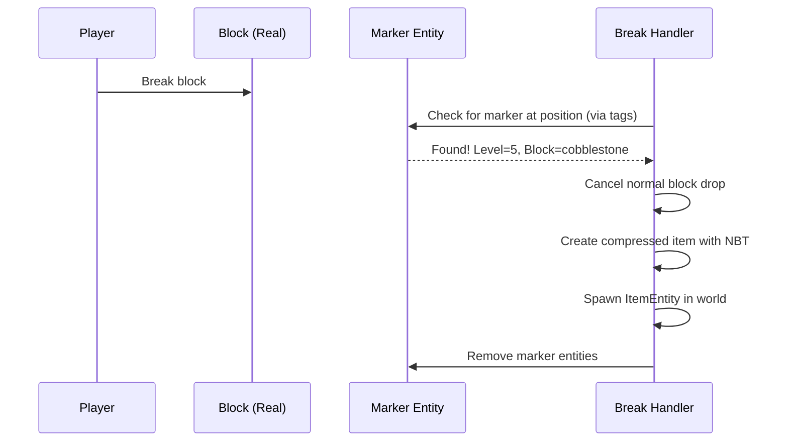
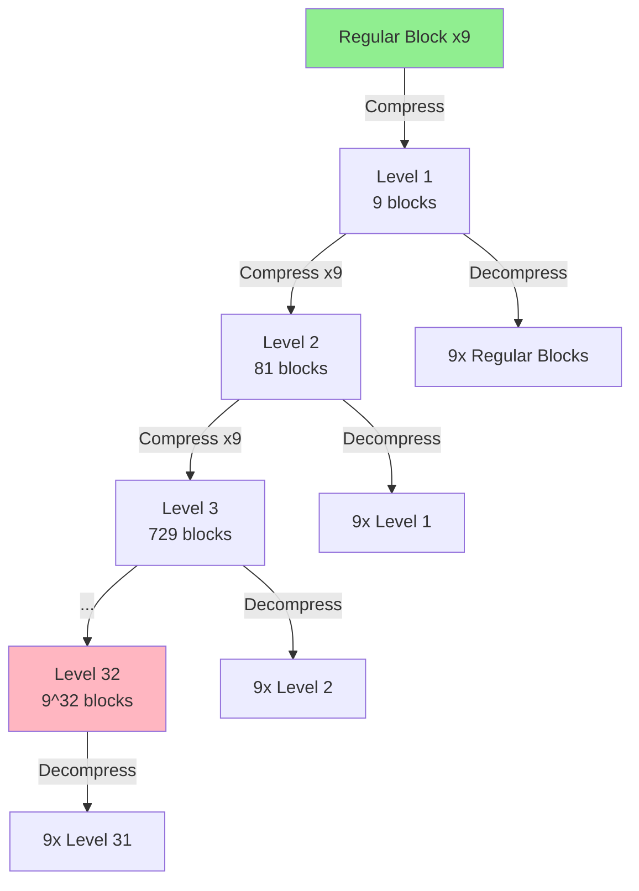
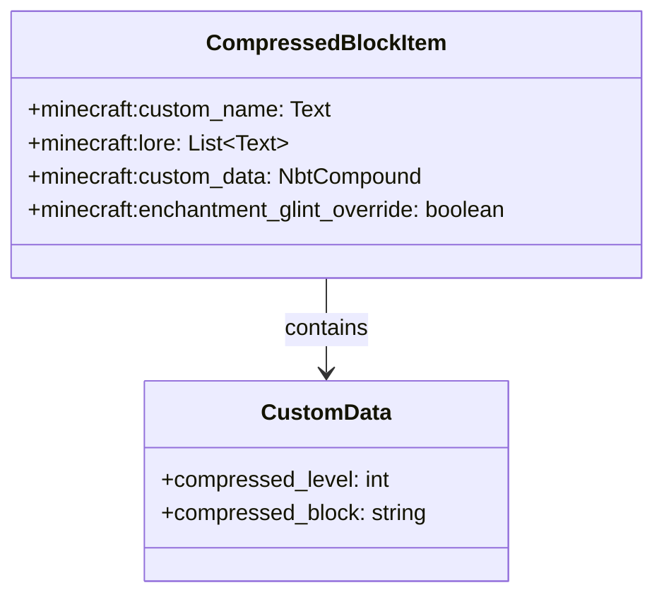
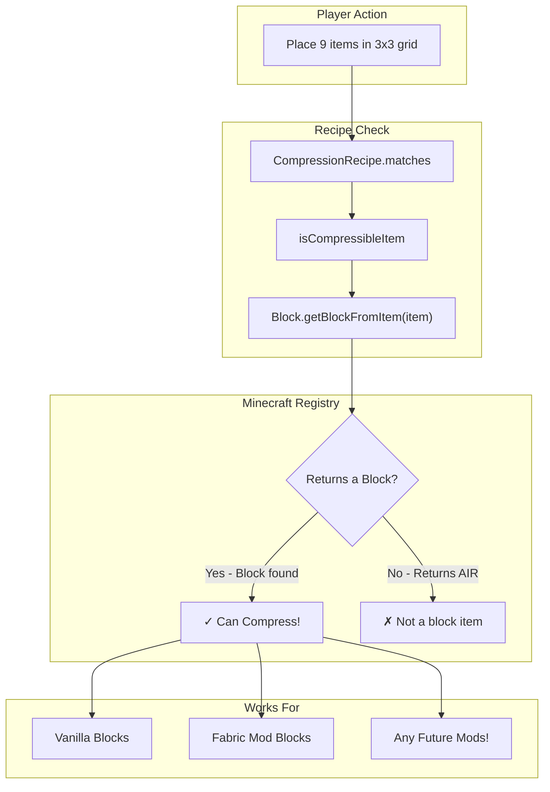
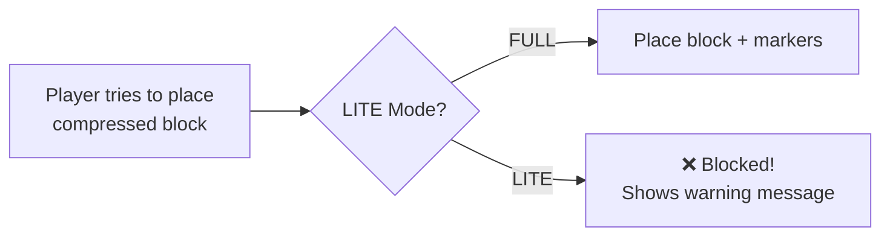

# 📦 Compressy

> **Squish ALL your blocks into tiny packages!**


---

## 🎮 What Does It Do?

**Turn 9 blocks into 1!** Then turn 9 of *those* into 1! Keep going up to **32 times!**

```
Level 1  = 9 blocks
Level 2  = 81 blocks
Level 3  = 729 blocks
Level 4  = 6,561 blocks
...
Level 32 = MORE BLOCKS THAN ATOMS IN THE UNIVERSE! 🤯
```

---

## ⚡ Quick Start

### Just Use a Crafting Table! 🎉

```
┌───┬───┬───┐
│ 🪨 │ 🪨 │ 🪨 │
├───┼───┼───┤
│ 🪨 │ 🪨 │ 🪨 │  →  📦 Compressed Stone [Lv.1]
├───┼───┼───┤
│ 🪨 │ 🪨 │ 🪨 │
└───┴───┴───┘
```

**That's it!** Fill a 3x3 grid with ANY block → Get 1 compressed block!

### To Decompress:
Put 1 compressed block alone in crafting grid → Get 9 back!

---

## 🔄 Standard Recipes = Mod Compatible!

Uses proper Minecraft recipes, so:
- ✅ Works in any crafting table
- ✅ Works with vanilla Autocrafter
- ✅ Works with automation mods (Create, AE2, RS, etc.)
- ✅ No special items required to compress!

---

## 🎯 How It Works

| Action | Result |
|--------|--------|
| **9 blocks in 3x3** | 1 compressed block |
| **Compressed block alone** | 9 blocks back |
| **9 compressed blocks in 3x3** | 1 higher-level compressed block |

---

## 📦 Two Versions Available

| Version | Best For |
|---------|----------|
| **FULL** | Single-player, creative builds, visual flair |
| **LITE** | Servers, automation-focused, maximum performance |

### FULL Version Features:
- ✅ Place compressed blocks in the world
- ✅ Visual overlays show compression tier (Roman numerals + darkening effect)
- ✅ Breaking returns the compressed block with all data intact
- ✅ Best for: Creative builds, visual storage displays

### LITE Version Features:
- ✅ Compressed blocks CANNOT be placed (inventory-only)
- ✅ No marker entities, no overlays, no world impact
- ✅ Zero performance overhead
- ✅ Best for: Servers, automation-focused gameplay, pure storage

---

## ⚙️ Configuration (ModMenu)

If you have [ModMenu](https://modrinth.com/mod/modmenu) installed, you can configure:

| Option | Description |
|--------|-------------|
| **Show Roman Numerals** | Toggle the tier display on placed blocks |
| **Show Darkening Overlay** | Toggle the visual darkening effect |
| **Block Exclusions** | Exclude specific blocks from compression |
| **Use Default Exclusions** | Auto-exclude non-solid blocks (flowers, torches, etc.) |

Config file location: `config/compressy.json`

---

## 💬 Commands

| Command | What It Does |
|---------|-------------|
| `/cblocks help` | Show help |
| `/cblocks info` | Info about held block |

---

## ❓ FAQ

**Q: What blocks can I compress?**  
A: Almost ALL of them! Stone, dirt, wood, glass, stairs, slabs... if you can place it, you can probably compress it!

**Q: Can I uncompress?**  
A: Yes! Just put the compressed block in a crafting grid to get 9 back!

**Q: Does it work in multiplayer?**  
A: Absolutely! Works on servers too!

**Q: Do I need to be OP?**  
A: Nope! Regular players can use all commands!

**Q: What's the difference between FULL and LITE?**  
A: FULL lets you place compressed blocks in the world with visual effects. LITE prevents placement entirely for pure inventory storage.

---

## 📥 Installation

1. Install [Fabric Loader](https://fabricmc.net/) (0.18.2+)
2. Install [Fabric API](https://modrinth.com/mod/fabric-api)
3. Download your preferred version:
   - `compressy-1.21.11-v1.x.x.jar` (FULL version)
   - `compressy-1.21.11-lite-v1.x.x.jar` (LITE version)
4. Drop the JAR in your `mods` folder
5. Play!

### Optional Dependencies
- [ModMenu](https://modrinth.com/mod/modmenu) - In-game configuration screen
- [Cloth Config](https://modrinth.com/mod/cloth-config) - Enhanced config UI

---

<br><br>

# 🏗️ Technical Documentation

*For modders, developers, and curious minds!*

---

## Architecture Overview



---

## Compression Flow (Crafting System)



### Decompression Flow



---

## Placed Blocks (FULL Version Only)

When you place a compressed block in the world, we preserve all the compression data using marker entities:



### Why This Approach?

1. **REAL BLOCK** - Full vanilla behavior (collision, redstone, piston, explosions)
2. **INTERACTION entity** - Invisible entity at block position stores data via tags
3. **TEXT_DISPLAY** - Shows the compression tier (Roman numeral) above block
4. **OVERLAY block_display** - Semi-transparent dark overlay for visual darkening

### Breaking Placed Blocks



---

## Data Flow for Compression Levels



---

## NBT Component Structure

Compressed blocks store their data in item components:



### Example NBT:
```json
{
  "minecraft:custom_data": {
    "compressed_level": 3,
    "compressed_block": "minecraft:cobblestone"
  }
}
```

---

## Automatic Block Detection System

**No config files. No block lists. No tags needed.**

We use Minecraft's built-in registry system:



### How It Works:

```java
// The magic line - queries Minecraft's block registry
var block = Block.getBlockFromItem(item);

// If it returns a real block (not AIR), it's compressible!
if (block != Blocks.AIR) {
    return true; // Can compress!
}
```

### Why This Works For ALL Mods:

1. **Registry-based** - When ANY mod registers a block, they also register a BlockItem
2. **Automatic linking** - Minecraft's registry links BlockItems to their Blocks
3. **Universal query** - `Block.getBlockFromItem()` queries this registry
4. **Zero config** - No need to add mod blocks to any list!

### What CAN Be Compressed:
- ✅ Any vanilla block (stone, dirt, logs, stairs, slabs, glass, etc.)
- ✅ Any modded block (Create, Botania, Mekanism, etc.)
- ✅ Already-compressed blocks (for higher tiers)

### What CANNOT Be Compressed:
- ❌ Items without block form (swords, tools, food, etc.)
- ❌ Level 32 compressed blocks (max tier reached)
- ❌ Excluded blocks (configurable via ModMenu)

---

## File Structure

```
compressy/
├── 📄 build.gradle              # Build configuration
├── 📄 settings.gradle           # Gradle settings
├── 📄 gradle.properties         # Version config
├── 📄 LICENSE                   # MIT License
│
├── 📁 versions/                 # Multi-version support (future)
│   └── 📄 1.21.11.properties    # Current version config
│
└── 📁 src/main/
    ├── 📁 java/com/compressy/
    │   ├── 📄 CompressyMod.java           # Main mod entry
    │   ├── 📄 CompressyBlockHandler.java  # Placement & breaking (FULL)
    │   ├── 📄 CompressyBlockHandlerLite.java  # Prevents placement (LITE)
    │   │
    │   ├── 📁 recipe/
    │   │   ├── 📄 CompressionRecipe.java
    │   │   ├── 📄 DecompressionRecipe.java
    │   │   ├── 📄 CompressionRecipeSerializer.java
    │   │   └── 📄 DecompressionRecipeSerializer.java
    │   │
    │   ├── 📁 config/
    │   │   ├── 📄 CompressyConfig.java     # Config management
    │   │   ├── 📄 CompressyModMenuIntegration.java
    │   │   ├── 📄 ClothConfigScreen.java   # Fancy config UI
    │   │   └── 📄 SimpleConfigScreen.java  # Fallback config UI
    │   │
    │   └── 📁 util/
    │       └── 📄 NbtHelper.java           # NBT utilities
    │
    └── 📁 resources/
        └── 📄 fabric.mod.json  # Mod metadata
```

---

## Build Variants

We provide **two versions** of the mod:

| Variant | File | Features |
|---------|------|----------|
| **FULL** | `compressy-1.21.11-v{version}.jar` | Place compressed blocks in world with visual overlays |
| **LITE** | `compressy-1.21.11-lite-v{version}.jar` | Inventory-only, no placement (lighter weight) |

### Why Choose LITE?

The LITE version is perfect for:
- 🎮 **Servers** - Zero world overhead, no entities to track
- ⚡ **Performance** - No block break interception, no entity spawning
- 📦 **Pure Storage** - Use compressed blocks only for inventory management
- 🔧 **Automation Focus** - Pairs perfectly with storage mods

### LITE Mode Behavior



---

## Building From Source

```bash
# Clone the repo
git clone https://github.com/Underwood-Inc/compressy.git
cd compressy

# Build everything (creates BOTH variants)
./gradlew build

# Outputs in build/libs/:
# - compressy-1.21.11-v{version}.jar (FULL version, remapped)
# - compressy-1.21.11-lite-v{version}.jar (LITE version, remapped)
# - compressy-1.21.11-v{version}-sources.jar (Source code)
```

### Runtime Mode Switch

You can also force LITE mode at runtime with a system property:
```bash
java -Dcompressedblocks.lite=true -jar minecraft_server.jar
```

---

## Contributing

1. Fork the repo
2. Create a feature branch
3. Make your changes
4. Test in-game (both FULL and LITE versions!)
5. Submit a PR!

---

## License

MIT License - Do whatever you want! Just give credit! 💜

---

<div align="center">

**Made with 💜 by the Underwood Inc team**

[Discord](https://discord.gg/mpThbx67J7) • [GitHub](https://github.com/Underwood-Inc) • [Modrinth](https://modrinth.com/mod/compressy)

</div>
